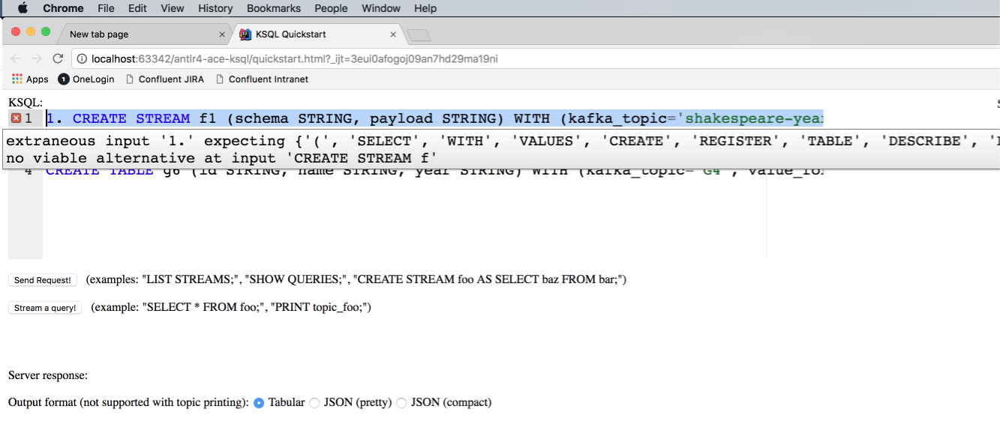

= ACE Editor for KSQL with syntax highlight and syntax validation using ANTL4 grammar
:icons: font

WARNING: it's just an experiment and POC. Not production ready!

== install

[source,shell]
.install web dependencies
----
bower -f install
----

== screenshot

== references

* https://github.com/maiermic/antlr4-javascript-examples[antlr4-javascript-examples]
* https://github.com/antlr/antlr4/blob/master/doc/javascript-target.md[ANTLR4 JavaScript target]
* https://github.com/antlr/antlr4/blob/master/doc/ace-javascript-target.md[specific page on ANTLR and ACE editor]
* https://github.com/confluentinc/ksql/blob/4.0.x/ksql-parser/src/main/antlr4/io/confluent/ksql/parser/SqlBase.g4[KSQL ANTLR4 grammar]